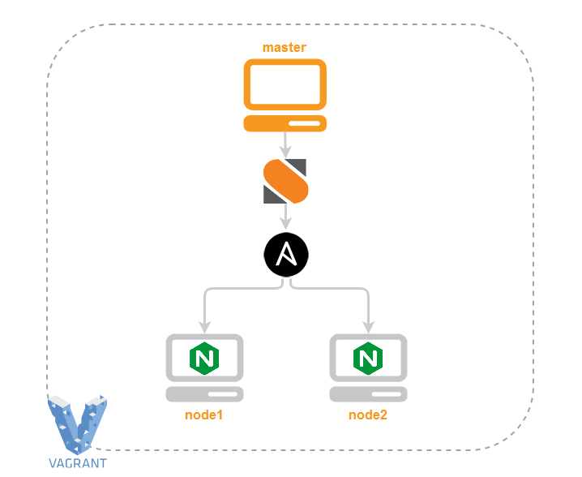

# Ansible

## Contents
- [Introduction](#introduction)
- [Example](#example)
- [Ad-hoc Commands](#ad-hoc-commands)
- [Ansible Vault](#ansible-vault)

## Introduction
Ansible is a popular IT automation engine that automates configuration management, cloud provisioning, software deployment and service orchestration.
### Benefits

- **Simple**
  It uses `yaml`,

- **Agentless**
  That is, when you create a controller, it contains the Ansible controller, but it does not require any configuration tool installation on the nodes it controls.

- **Secure**
  It uses `ssh` to connect to other servers.

- **Efficient SDLC**
  Integrates with other tools, 
  We can change provider very easily.

## Example 

### Architecture
In this example, we will create three Virtual Machines with Vagran that correspond; the *Controller*, the *Web* and the *Database* servers.
The configuration of the machines can be seen in the `Vagrant` file.



### Task
The aforementioned machines, aliased as `controller`, `web` and `db` have been assigned with IPs `192.168.33.12`, `192.168.33.10` and `192.168.33.11` accordingly.

After spinning up the machines, we can `ssh` from the *Controller* with password `vagrant`

We need to install `ansible` on the controller, so we create a shell script that includes the commands needed to install it.
The shell script, called `provision.sh` can be found on the repository.
After installing the provision file in the controller virtual machine, we can check if ansible was installed correctly
We can use `ansible --version`

In the `/etc/ansible/hosts`, we can add the connection configurations, like hostnames, passwords, etc.
```
[web]
192.168.33.10 ansible_connection=ssh ansible_ssh_user=vagrant ansible_ssh_pass=vagrant
```

We can check if ansible has a connection with the server with the `ping` module:
```bash
ansible -m ping web
```
If the `ping` works, we would receive a message back like the one below:
```bash
192.168.33.10 | SUCCESS => {
    "ansible_facts": {
        "discovered_interpreter_python": "/usr/bin/python3"
    },
    "changed": false,
    "ping": "pong"
}
```

## Ad-hoc commands
When we bring up the machines with vagrant, or any other cloud provider, we can 'send' some commands to the servers that are connected 

We can run thses commands with the `-a` flag, which is used to pass module arguments.
For example, we can run:
```bash
ansible web -m shell -a 'ls -a'
```

We can run the commands to all the agent servers if we use `all` instead of a specific server.
For example, the below command will ping all the agent servers connected to the controller
```bash
ansible all -m ping
```

### Ad-hoc Tasks
- Task 1: Find the `uptime` of the `db` server using ansible *ad-hoc* commands

  Once we make sure that the `db` server is connected to the controller (is entered in the `/etc/ansible/hosts` file) we can use `uptime` with the below `ad-hoc` command:
  ```bash
  ansible db -m shell -a 'uptime'

  ```
- Task 2: Update and upgrade all packages in all agents using *ad-hoc* commands:

  We can update and upgrade using the `shell` module again:
  ```bash
  ansible all -m shell -a 'sudo apt-get update -y && sudo apt-get upgrade -y'
  ```

  ## Ansible Playbooks
  The playbooks are configuration files written in `yamnl`
  We have created several playbooks to install software required in our servers.
  The files are split so that we can run each of them separately without fear of timing out if an error occurs in one of the steps.


## Ansible Vault
  We need to install 
  - `python3`
  - `pip3`
  - `ansible`
  With pip we install
  - `awscli`
  - `boto` & `boto3`

We can create the ansible vault with the `ansible-vault` command. We need to input a password that will be used to encrypt the file.
Inside the file, we need to enter our access key and secret key for our AWS account or IAM role:
```yaml
aws_access_key: <access_key>
aws_secret_key: <secret_key>
```

After adding the vault password, ansible will attempt to use it to login.
However, since the login credentials are not related to our vagrant setup, the execution of playbooks will fail.
If we still need to execute playbooks in our vagrant cluster, we need to remove the `pass.yml` file we created earlier (or change the name to `pass.yml.bkp` for example)
Then, we need to `ssh` into the machine we need to connect to and make some changes to the `sshd_config` file.
```bash
ssh vagrant@<machine-ip>
cd /etc/ssh/
sudo vim sshd_config
```
Inside the `sshd_config` file, we need to make sure the options `PermitRootLogin` and `PasswordAuthentication` are uncommented and are followed by the keyword `yes`:
```bash
PermitRootLogin yes
# ...
PasswordAuthentication yes
# ...
```
After that, we can try to execute the ansible playbooks from the controller like normal.


