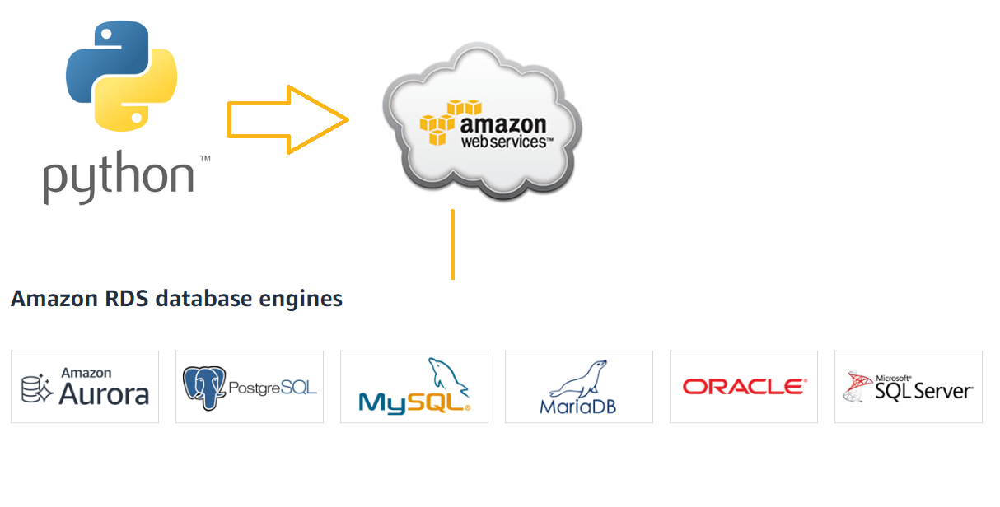

# Python Database

Most software applications require the storage and maintenance of persistent data.
For that reason, a database is used, like SQL.

In order to communicate with the Database Management System of SQL Servers, the different **Python SQL Libraries** can be used.

In this lesson, the `pyodbc` library is used to connect to an AWS hosted database that is using the SQL Server DBMS by Microsoft.
The DB is running the Northwind example dataset for testing purposes.



## Establishing connection with `pyodbc`
```python
# define connection credentials
server = <database-location or ip>
database = <database name>
username = <username>
password = <password>
db = pyodbc.connect('DRIVER={ODBC Driver 17 for SQL Server};SERVER='+server+';DATABASE='+database+';UID='+username+';PWD='+password)
```
When establishing connection with SQL Server on ubuntu, the following dependencies may be required:
- `unixodbc-dev`
- [msodbcsql17 driver](https://packages.microsoft.com/ubuntu/18.04/prod/pool/main/m/msodbcsql17/)

The `unixodbc-dev` dependency can be installed with `apt`:
```
sudo apt update
sudo apt install unixodbc-dev
sudo apt upgrade
```
## Testing connection
To test the connection with the database, we execute a query asking for the database version
```python
cursor = NorthwindDB.cursor()
cursor.execute("SELECT @@version;")
```


## Fetching data
After executing a query, we can eiter fetch all the data, or fetch one with the `fetchall` and `fetchone` methods accordingly.
Examples:
```python
# We use execute to run our queries with a string and fetch first record
customer_row = cursor.execute("SELECT * FROM Customers").fetchone()
print(cutomer_row)

# We can also iterate through the data records and fetch one each time
while True:
    # As long as there is data availabel, keep runnign
    record = product_rows.fetchone()
    # If there is no more data, then stop.
    if record is None:
        break
    print(record.UnitPrice)

# Execute query but fetch all results
product_rows = cursor.execute("SELECT * FROM PRODUCTS").fetchall()
print(product_rows)

# We can iterate through the results to print each row on a separate line:
for row in customer_rows:
  print(row.UnitPrice)
```

To close the establish connection, we can use the `close` keyword:
```python
NorthwidnDB.close()
```

## Applying CRUD
In order to apply CRUD we need **Data Manipulation Language** (**DML**) statements like `INSERT`, `UPDATE` and `DELETE`
```python
# To insert record, we need to know the fields for the record
query = """
INSERT INTO Products (ProductName, UnitPrice)
VALUES
("Apple", "1")
"""
cursor.execute(query)

# To remove record, we can specify the record to remove with a query
query = "Apple"
cursor.execute("DELETE FROM Products WHERE ProductName = '{}'.format(query))

# We can also update a record:
query = 'Apple'
new_price = 2 
cursor.execute("UPDATE Products SET UnitPrice = {} WHERE ProductName = {}".format(new_price, query))
```

