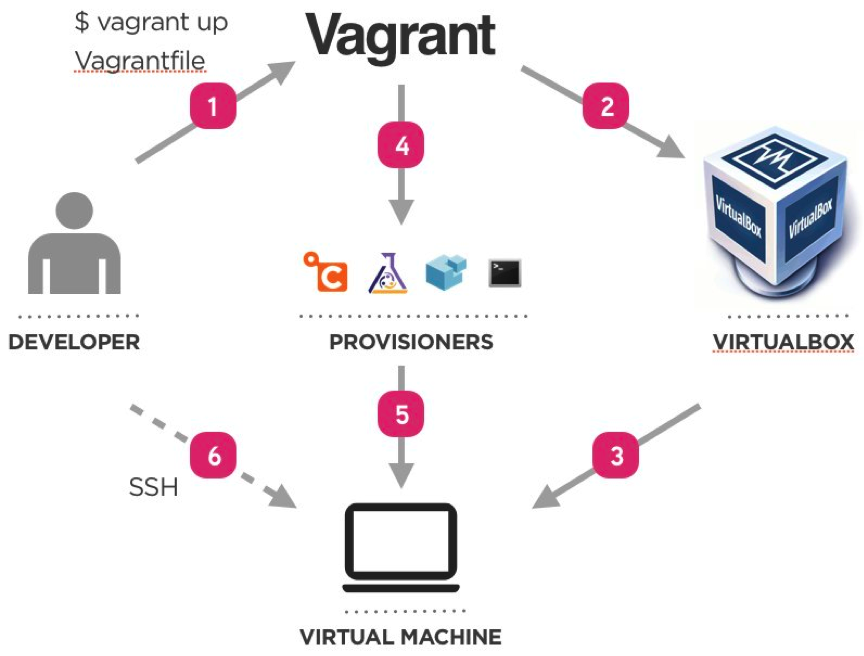

# Vagrant
```bash
# Automatically create a vagrant file with <image> as os
vagrant init <image>
# Spin up the virtual machine based on the Vagrantfile
vagrant up
vagrant destroy
vagrant reload
vagrant 
```

# Linux commands:
```bash
# name of pc
uname

# list directories
ls

# make directory
mkdir <name>

# create file
touch <file name>

# escalate priviliges (admin)
sudo <command>

# change user to root
sudo su

# go up one directory
cd ..

# Print working directory
pwd

# Rename, or move files
mv <old-filename> <new-filename>

# Copy file
cp <filename> <path>

# Delete file
rm <filename>

# List files with more info (and permissions)
```

- attach box to ip in private network

We can install a webserver to check that the network works
```
sudo apt install nginx -y
```
Check status of process
