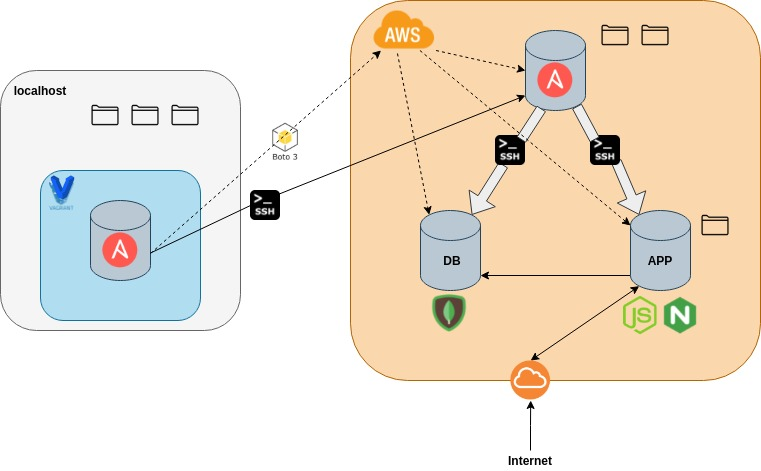

# Ansible Task

## Task
Use ansible playbooks to launch 3 machines on AWS: a controller, a web-app and a database.
Implement the 2 tier architecture as IAC with ansible
Node app has to work with public IP and db working with `/posts`

## Solution
### Architecture
In this task, we are using a Vagrant VM as a controller, which spins up two EC2 instances on AWS as agents.

### Networking
The netwoprking is done *ad-hoc*.
Firstly, we bring up a local controller using vagrant. 

### Provision
### Configuration

### Notes
#### SSH connections with Ansible
#### Groupsnames and Hostnames
#### Env variables 

