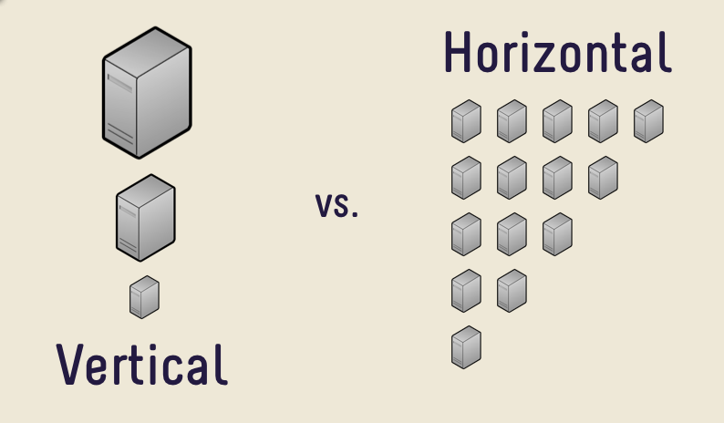

# Cloud Computing

## Introduction

### What is Cloud Computing
Cloud computing is the practice of using and paying for servers and computing resources on demand, over the internet. The servers are set up and maintained by a third party, instead of having your own servers to host products.

### What are the benefits of cloud computing
The benefits of using cloud computing is, as opposed to using your own servers are:
- Cost Savings

  Using cloud computing may reduce the cost of managing and maintaining IT systems. Rather than purchasing expensive systems and equipment, most companies reduce costs by using the resources of cloud computing service providers. 
  As many businesses have seasonal traffic, or even may have most traffic on predictable hours of the day, they can make use of only of the resources they need, and therefore reduce costs when there is not a lot of demand.

- Scalability

  Businesses that use cloud computing can scale up or down their operation and storage according to their needs. 
  Rather than purchasing and installing expensive servers by themselves, they use the servers provided by the cloud computing and can in a moments notice, they can increase or decrease the number of servers, or their capabilities, to suit their needs.

- **Reliability**

  Well established cloud computing providers can boast of highly reliable servers with minimal down time, as their business model is reliant on this aspect.
  With the use of reproducability and automation tools, a different server can be spun up with the same state, in the small chance that our original server goes down.

- ***Security*

  Depending on the provider, many cloud services have firewalls and other protection methods against malicious attacks. Additionally, they can provide backups and other support for sensitive data.

### Cloud Computing types
- **Private Cloud**: Clouds hosted and maintained by the user.
- **Public Cloud**: Clouds that are hosted and maintained by a cloud computing provider
- **Hybrid Cloud**: A combination of the above two types

### Scaling
Scaling refers to changing the capabilities of the hosting servers with the goal of adapting the throughput of the application. As traffic increases or decreases, we need to scale up or scale down accordingly so that the application needs are met. There are two types of scaling that can be applied:

- **Horizontal Scaling**

Refers to the increase or decrease of the number of servers that are used. Typically, an 'image' or snapshot of a running server is made so that different replica sets can be made of the first one. 
Having many servers can increase the amount of users the application can serve, as the servers are working in parallel.

- **Vertical Scaling**

This type of scaling refers to 'upgrading' the server where the application is hosted so that it can serve users faster. Additionally, with a more capable server, more threads can be created that can also serve customers concurrently.

## Architecture

### One tier architecture
A single-tier application has all the layers, such as presentation, application and database in the same 'package'. This means that the application and database are on the same host. Single-tier applications are vulnerable and non-flexible. (stateful - complex replication)

### Two tier architecture
### Three tier architecture

# AWS

## What is AWS
AWS is the larger cloud computing provider with servers in every continent. AWS are trusted by large companies like Netflix, BBC, Facebook and Twitch, which accentuates their reliability and range of services.
The benefits of AWS over its competitors is that their services are efficient, competitive and reliable. 
Security group works in the instance level

## Getting started with AWS
To get started with AWS we need to either create new user, or acquire an IAM access role to work in an organisation's account.

## EC2 - Elastic Compute Cloud
Elastic Compute Cloud is an AWS service that provides secure, resizable compute capacity in the cloud. They are virtual machines hosted on the cloud, which means that we can choose an operating system, CPU capabilies, memory capacity and other settings, according to our needs.
EC2 instances are charged according to the time they spend on *Running* state, and have a mutliplier applied according to their CPU and RAM capabiliy 'level'. 

## AWS Regions, Edge Locations and Availability Zones
- **Region**: 

A **Regions** are the physical locations where clusters of AWS data centers exist. 
By choosing a region for our application, we can choose to have our application be geographically close to our users, so that the connection latency can be reduced.

- **Availability Zone**

**Availability Zones** correspond to discrete data centers with redundant power, networking and connectivity in an AWS Region. We can choose to host our application in one or more *Availability Zones* in order to have our application work in case there is an outage in a specific datacenter.

- **Edge Location**

**Edge Locations** refer to locations from where the global *CloudFront* network can provide its service. The *CloudFront* service is a **Content Delivery Network** (**CDN**) that focuses on *'caching'* responses from our website so that repeated requests are not handled by our servers.
Along with other security features, like DDOS attack protection, the CDN provided by AWS is a useful feature to increase our application availability.

## VPC, Subnets and Security Groups
One of the services provided by AWS is the use of Virtual Private Networks in the cloud, named **Virtual Private Cloud** (**VPC**).
With the help of these networks, we can provide an added layer of security to our application and create multi-tiered applications with services that talk with eachothers in an internal network.

### VPC
A **Virtual Private Cloud** (**VPC**) is, in essence a *Virtual Private Network* on the cloud. That means, it has network interface to connect to the internet, and any other applications need to connect through it to reach the internet. 
This interface is called the **Internet Gateway** and we need to create it in AWS if we want to enabel internet access to our network.

### Subnet
Inside the VPC, we can create **Subnets** which are, again, Virtual Private Networks, although they are within our initial VPC.
As they are within our initial VPC, the access to these subnets is as restrictive as the VPC rules. However, we can add more restrictive rules if we want more protection for sensitive services, like Databases. 
In order to allow communication between subnets, we can create a **Routing Table** to include or exclude the path to the Internet Gateway, or the other subnet IPs. 
To fur
We achieve this with the use of **Network ACL** rules.

### Security Groups
Security Groups is a collection of rules that control the inbound and outbound traffic for our instances. Each EC2 instance has at least one security group attached

### NACL
**Network ACL** (**NACL**) control inbound and outbound traffic for subnets. Added layer of security, on top of *Security Group*

### Stateful vs Stateless Filtering
Stateful filtering allows responses to go back out even if the outbound don't allow it, as long as the inbound rules allow the request to arrive. Stateless filtering will not allow for the responce to go through in the same scenario.
Security groups are an example of a stateful filtering method, while NACLs are stateless.

### Creating a VPC

### Creating an EC2 Instance
To create an EC2 instance, we first need to go to the EC2 panel. From there we press the 'Create new Instance' button, and we are met with a number of settings we can choose:
1. Image

We first need to choose an AMI image for the EC2 instance. There are many 'blank' images that only include the operating system, but we can create our own AMI image in the future that includes custom installation of software we might need.

2. Provisioning

At this stage, we need to choose the capabilites of the instance. There is a free tier available for free 

Image
CPU Tier
Settings
Storage
Tags
Security Groups
ss

## Connecting to Instance

## Copying files
We can copy files to our newly created EC2 instance with the `scp` command

