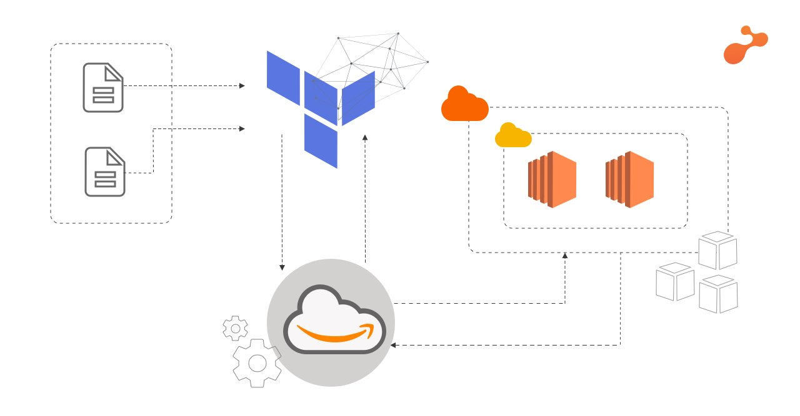

# Terraform

Terraform is an open source infrastructure as code tool. It is used for building, changing and versioning infrastructure safely and efficiently.
It is written in Go. Terraform is logically split intop two main parts: **Terraform Core** and **Terraform Plugins**.
## Benefits

## Cheat Sheet
```
# Initialise new project
terraform init

# Plan changes
terraform plan

# Apply planned changes
terraform apply

# Destroy the infrastructure previously created with terraform
terraform destroy

```

## Installation
Terraform can be downloaded, or installed as shown in this [tutorial](https://learn.hashicorp.com/tutorials/terraform/install-cli)
## Terraform to lauch ec2 with VPC, subnets, SG services of AWS



### Securing AWS keys
The AWS provider offers a flexible means of providing credentials for authentication.
The following methods are supported:

- Static credentials
- Environment variables
- Shared credentials / configuration file
- CodeBuild, ECS and EKS Roles
- EC2 Instance Metadata service

The static credentials are not recommended as they will be visible when uploaded on version control software like github.

Therefore, the credentials will be provided via environment variables.
The variables need to be named `AWS_ACCESS_KEY_ID` and `AWS_SECRET_ACCESS_KEY` representing the AWS Access Key and AWS Secret key respectively.
Additionally, the `AWS_DEFAULT_REGION` and `AWS_SESSION_TOKEN` environment variables are also supported.
