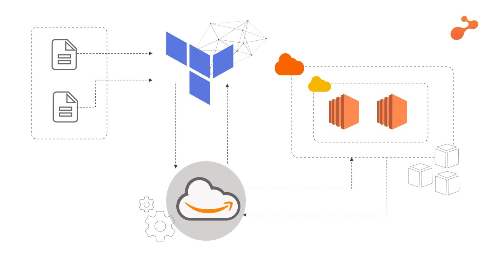

# Terraform

Terraform is an open source infrastructure as code tool. It is used for building, changing and versioning infrastructure safely and efficiently.
It is written in Go. Terraform is logically split intop two main parts: **Terraform Core** and **Terraform Plugins**.
## Benefits

## Cheat Sheet
```
# Initialise new project
terraform init
terraform plan
terraform apply
terraform destroy

```

## Installation

## Terraform to lauch ec2 with VPC, subnets, SG services of AWS



### Securing AWS keys

Name of environment variables are `AWS_ACCESS_KEY_ID` and `AWS_SECRET_ACCESS_KEY`.
