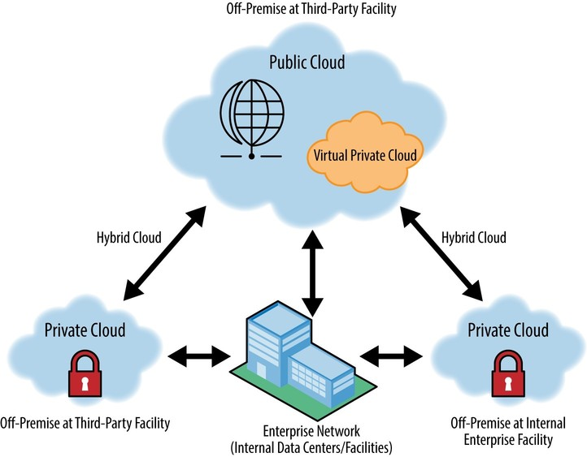
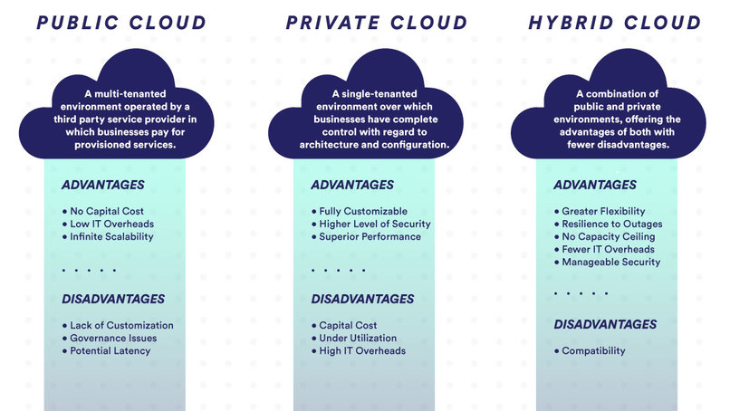
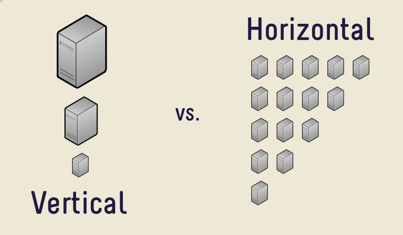
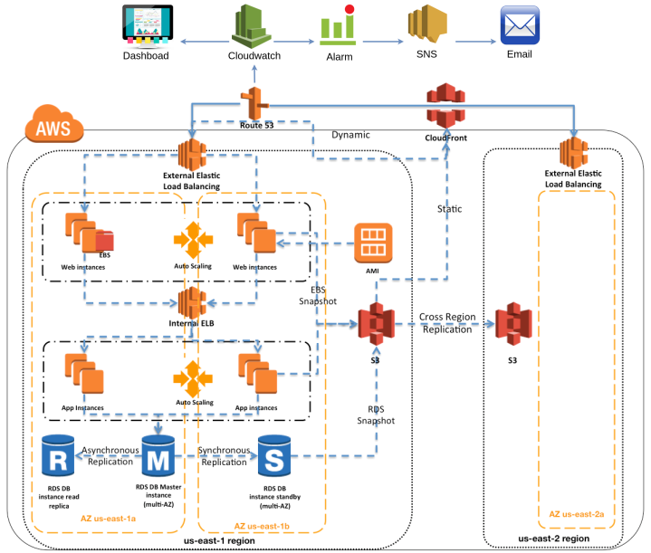

# Cloud Computing

## Introduction
### What is Cloud Computing
Cloud computing is the practice of renting servers and computing resources on demand, over the internet. The servers are set up and maintained by a third party, instead of having your own servers.

### What are the benefits of cloud computing
The benefits of using cloud computing is, as opposed to using your own servers are:

- Cost Savings

  Using cloud computing may reduce the cost of managing and maintaining IT systems. Rather than purchasing expensive systems and equipment, most companies reduce costs by using the resources of cloud computing service providers. 
  As many businesses have seasonal traffic, or even may have most traffic on predictable hours of the day, they can make use of only of the resources they need, and therefore reduce costs when there is not a lot of demand.

- Scalability

  Businesses that use cloud computing can scale up or down their operation and storage according to their needs. 
  Rather than purchasing and installing expensive servers by themselves, they use the servers provided by the cloud computing and can in a moments notice, they can increase or decrease the number of servers, or their capabilities, to suit their needs.

- **Reliability**

  Well established cloud computing providers can boast of highly reliable servers with minimal down time, as their business model is reliant on this aspect.
  With the use of reproducability and automation tools, a different server can be spun up with the same state, in the small chance that our original server goes down.

- ***Security*

  Depending on the provider, many cloud services have firewalls and other protection methods against malicious attacks. Additionally, they can provide backups and other support for sensitive data.

### Cloud Computing types
- **Private Cloud**: Clouds hosted and maintained by the user.
- **Public Cloud**: Clouds that are hosted and maintained by a cloud computing provider
- **Hybrid Cloud**: A combination of the above two types

Private clouds are used for applications for sensitive data, including financial institutions or goverments. The hybrid cloud is used when storage of sensitive data is required, however the services offered by cloud providers are also needed.
Generally, private clouds are much costier as they require buying the resources, paying operation costs, maintenance and specialists to handle the maintenance, migrations etc.

### Scaling
Scaling refers to changing the capabilities of the hosting servers with the goal of adapting the throughput of the application. As traffic increases or decreases, we need to scale up or scale down accordingly so that the application needs are met. There are two types of scaling that can be applied:

- **Horizontal Scaling**

Refers to the increase or decrease of the number of servers that are used. Typically, an 'image' or snapshot of a running server is made so that different replica sets can be made of the first one. 
Having many servers can increase the amount of users the application can serve, as the servers are working in parallel.

- **Vertical Scaling**

This type of scaling refers to 'upgrading' the server where the application is hosted so that it can serve users faster. Additionally, with a more capable server, more threads can be created that can also serve customers concurrently.

## Architecture

### One tier architecture
A single-tier application has all the layers, such as presentation, application and database in the same 'package'. This means that the application and database are on the same host. Single-tier applications are vulnerable and non-flexible. (stateful - complex replication)

### Two tier architecture
### Three tier architecture

## High Availability Applications
High-availability application architecture is   

