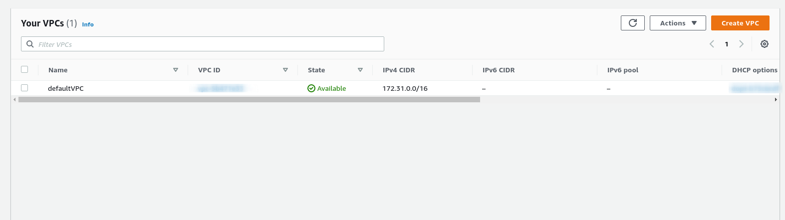
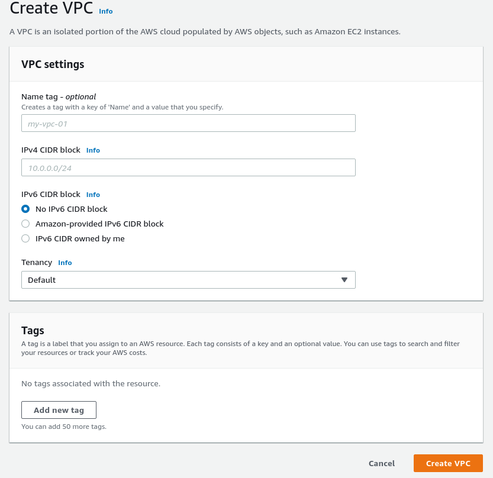
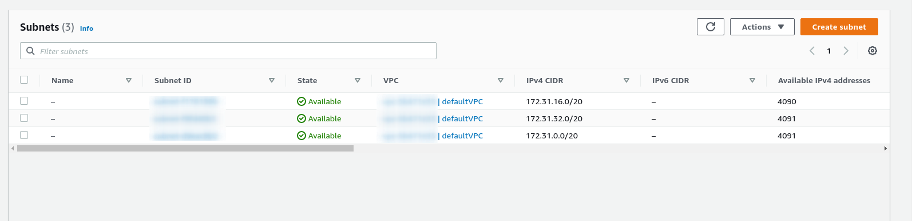

# AWS Guide
In this guide, we show how to create AWS resources with the online console provided by Amazon.

## Table of Contents
- [VPC](#vpc)
- [Subnets](#subnets)
- [Internet Gateway](#internet-gateway)
- [Network ACL](#network-acl)
- [Security Groups](#security-groups)
- [EC2](#ec2)
- [Scenario](#scenario)

## VPC
To create a *Virtual Private Cloud*, we first need to find the VPC option on the services panel. We can search for it on any page with the `Alt+S` keyboard shortcut.
We then need to go to the "*Your VPCs*" tab found on the left side pane. After pressing the option, we are greeted with a list of all the existing VPCs in the current *Region*.
If no VPCs have been made yet, only the default VPC can be seen here. 

From this page, choose the orange button on the upper-right side of the page, labeled '*Create VPC'.
Then, we are presented with a page where we can fill the settings for our new VPC:

The name of the VPC should be descriptive of its use. The names don't have to be unique, as they are not used for identification by AWS, but they should be to avoid confusion. 

The **CIDR** blocks can be any range of IP addresses with sizes between `/16` and `/28` (65,536 to 16 IP addresses respectively).
The number of IPs should be chosen according to the number of devices that will be included in all the subnets.

It is recommended to use one of the `RFC1918` defined addresses for the VPC CIDR blocks, however any IP range, with size as specified above, can work.
| `RFC1918` range | AWS example range|
| ---             | ---               |
| `10.0.0.0` - `10.255.255.255` (`/8` block) | `10.0.0.0` - `10.0.255.255` (`/16` block) |
| `172.16.0.0` - `176.31.255.255` (`/12` block) | `172.16.0.0` - `172.16.255.255` (`/16` block) |
| `192.168.0.0` - `192.168.255.255` (`/16` block) | `192.168.0.0` - `192.168.255.255` (`/16` block) |

> Note: It should be taken in account that the first three IPs of the VPC block are reserved by AWS for internal use.

Additional tags can be added if needed. 

When the settings are completed, press the 'Create VPC' button

## Subnets
A subnet can be created only after we have created a VPC. We cannot place a subnet inside the default VPC as all the IP ranges were taken by the default subnets.

To create a subnet, first go to the VPC service, then navigate to the 'Subnets' option on the left-side pane. A list of all available subnets is shown.

## Internet Gateway 
## Routing Tables
## Network ACL

## Security Groups

## EC2
To create an EC2 instance, we first need to go to the EC2 panel. From there we press the 'Create new Instance' button, and we are met with a number of settings we can choose:
1. Image

We first need to choose an AMI image for the EC2 instance. There are many 'blank' images that only include the operating system, but we can create our own AMI image in the future that includes custom installation of software we might need.

2. Provisioning

At this stage, we need to choose the capabilites of the instance. There is a free tier available for free 

Image
CPU Tier
Settings
Storage
Tags
Security Groups
ss

## Connecting to Instance

## Copying files
We can copy files to our newly created EC2 instance with the `scp` command

## Scenario
