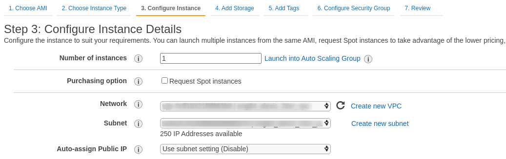
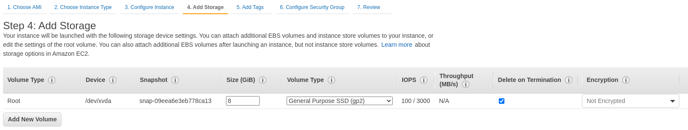
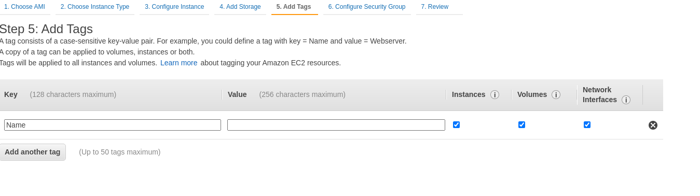
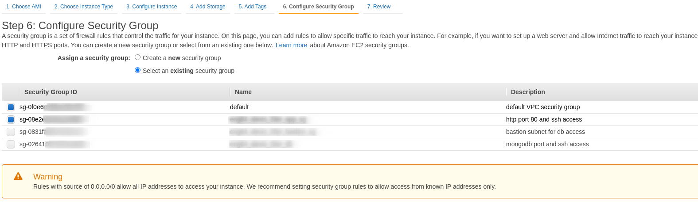
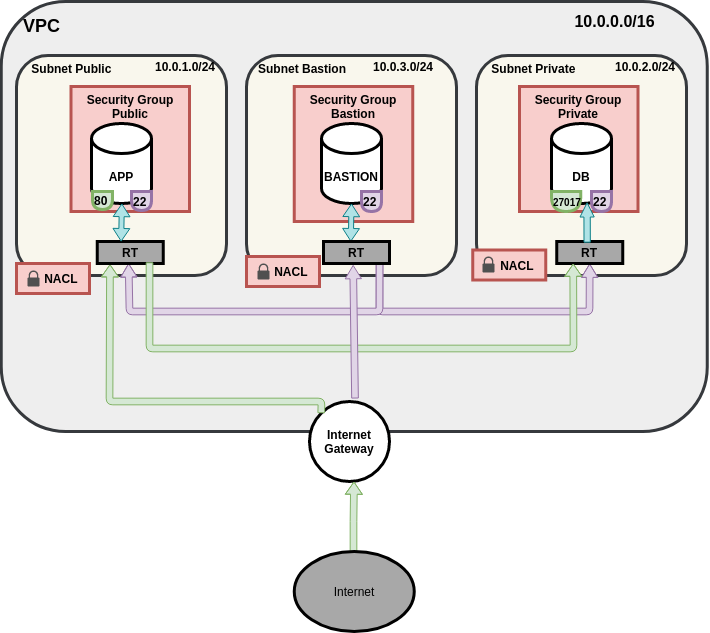

# AWS Guide
In this guide, we show how to create AWS resources with the online console provided by Amazon.

## Table of Contents
- [VPC](#vpc)
- [Subnets](#subnets)
- [Internet Gateway](#internet-gateway)
- [Network ACL](#network-acl)
- [Security Groups](#security-groups)
- [EC2](#ec2)
- [Connecting to Instances](#connecting-to-instance)
- [Setting up AWS-CLI](#setting-up-aws-cli)
- [S3](#s3)
  -[S3 with aws-cli](#s3-with-awscli)
  -[S3 with python](#s3-with-python)
- [Scenario](#scenario)

## VPC
To create a *Virtual Private Cloud*, we first need to find the VPC option on the services panel. We can search for it on any page with the `Alt+S` keyboard shortcut.
We then need to go to the "*Your VPCs*" tab found on the left side pane. After pressing the option, we are greeted with a list of all the existing VPCs in the current *Region*.
If no VPCs have been made yet, only the default VPC can be seen here. 


From this page, choose the orange button on the upper-right side of the page, labeled '*Create VPC'.
Then, we are presented with a page where we can fill the settings for our new VPC:


The name of the VPC should be descriptive of its use. The names don't have to be unique, as they are not used for identification by AWS, but they should be to avoid confusion. 

The **CIDR** blocks can be any range of IP addresses with sizes between `/16` and `/28` (65,536 to 16 IP addresses respectively).
The number of IPs should be chosen according to the number of devices that will be included in all the subnets.

It is recommended to use one of the `RFC1918` defined addresses for the VPC CIDR blocks, however any IP range, with size as specified above, can work.
| `RFC1918` range | AWS example range|
| ---             | ---               |
| `10.0.0.0` - `10.255.255.255` (`/8` block) | `10.0.0.0` - `10.0.255.255` (`/16` block) |
| `172.16.0.0` - `176.31.255.255` (`/12` block) | `172.16.0.0` - `172.16.255.255` (`/16` block) |
| `192.168.0.0` - `192.168.255.255` (`/16` block) | `192.168.0.0` - `192.168.255.255` (`/16` block) |

> Note: It should be taken in account that the first three IPs of the VPC block are reserved by AWS for internal use.

Additional tags can be added if needed. 

When the settings are completed, press the 'Create VPC' button

## Subnets
A subnet can be created only after we have created a VPC. We cannot place a subnet inside the default VPC as all the IP ranges were taken by the default subnets.

To create a subnet, first go to the VPC service, then navigate to the 'Subnets' option on the left-side pane. A list of all available subnets is shown.


## Internet Gateway 
## Routing Tables
## Network ACL
We need to give inbound and outbound rules for our NACL instance since they perform stateless filtering. The rule associated with them is used for the ordering of the rules.

For example in this instance we create the following rules:
NACL Inbound:
- 100: Allows inbound HTTP traffic from IPV4 addresses.
- 110: Allows inbound SSH traffic from network over the internet. We should let it 
- 120: Allows inbound return traffic from hosts on the internet that are responding.
NACL Outbound:
- 100: allow prot 80
- 110: allow cidr block 

## Security Groups


## EC2

To create an EC2 instance, we first need to go to choose the EC2 option from the AWS services panel.
After choosing the EC2 option, we are presented with a summary panel for all the EC2 instances on the current *Region*. 
At this point, we should switch to the *Region* we want, if it the correct one is not selected. 

We can view a more detailed list of the EC2 instances by clicking the `Instances` option on the left-side panel, or by clicking the summary box for `Instances` or `Instances (running)`.
Both options lead to the same page, but the latter option applies a filter to show only the *running* instances. 
EC2 instances have several states (*running*, *stopped*, *pending*, *terminated*). They are being priced only when they are on a running state. 
As EC2s instances are *Virtual Machines* on the cloud, they require some time to start running after we have provisioned them. During this time, they will be on a `pending` state.

After they complete the provision stage, they will have a private IP for the subnet they are currently in (`default` VPC and subnet if not specified) and a public IP if it was requested.
The EC2 public IP of the EC2 instance may change if it is rebooted, as AWS recycles public IPs when instances are stopped. We can have a specific IP if an **elastic IP** is associated with the instance.
Private IPs do not change, as long as the EC2 instance exists. 

From the *Instances* list, we press the orange button labeled `Create new Instance` to be directed to the EC2 instance creation wizard, where we have to choose the settings for the instance.

1. Image
Firstly we have to choose an image for the machine. 
The image may contain only the baseline operating system, an operating system and a few programs installed, or it can be a custom image we created with all the programs we need on the OS of our choice.
There are several images that are free-tier, including many Linux Ubuntu and Windows operating systems.

2. Provisioning

At this stage, we need to choose the capabilites of the instance. There is a free tier available with a lower CPU and memory capacity.
We can choose that instance for testing purposes.

3. Configure Instance

In this part, we can specify the VPC of the instance, the subnet, availability zones and other settings. 
We also need to enable the auto-assign for Public IP if the subnet settings don't specify it.
With this setting, we will assing an IP to the instance so that we can connect to it with `ssh` or connect to the internet without a NAT Gateway.
We don't need to change any other settings for this use case.


4. Storage

After we configure the VPC, we need to specify the amount of storage we would like to add. We can also attach other EBS volumes here that can persist or are shared between instances.



5. Tags

By adding tags, we can label our instance with helpful information. Tags work as a key-value pair, so we need to add the name of the tag and its value.



6. Security Groups

In this page, we can add security groups to our instance, or create new ones before adding them. If we have already configured the instance VPC, then only the security groups that are in that VPC will show up.


7. Summary

8. Key

As a final step before the instance is launched, a pop-up menu is shown that asks us for the ssh key we would like to choose.
We can create a new key from this menu and download it; or we can use an existing key pair

As an added reminder, a tickbox is included that reminds us to check if the `ssh` key is available in our system.

## Connecting to Instance
In order to connect to the instance, we use the `ssh` command. 
We need some information before we connect though. Firstly we will need to find the path to the `.pem` file that was chosen right before the instance was launched. This file is used for identification.
We will also need the public IP of the instance we will connect to, and the default username. The IP can be found from the instance panel, while the username is based on the image used to launch the instance:
|AMI|username|
| ---| ---|
| Amazon Linux 2| `ec2-user`|
| Fedora | `ec2-user` or `fedora`|
| RHEL | `ec2-user` or `root`|
| CentOS | `cetnos`|
| Debian | `admin`|
| Ubuntu | `ubuntu`|

For example, we can connect to an ubuntu instance with public IP address `54.299.125.222` with the below command:

```bash
ssh -i ~/.ssh/IdentityFile.pem ubuntu@54.299.125.222
```
When we connect to the instance for the first time, it will ask for confirmation, as our localhost hasn't connected to this device before and doesn't have it listed in the known hosts. 

Additionally, we can forego adding the `-i` flag by registering it with the **ssh-agent**, or using an *ssh configuration file*. 
For the first method, if we are using a Linux system, we can check if the `ssh-agent` is working by checking its PID. Alternatively, we can check for the identities that are registered already.
```bash
# check if the ssh agent process is running:
echo $SSH_AGENT_PID

# list ssh-agent registered identities
ssh-add -L
```
If the agent is not running, we can start it with the following commands.
```bash
eval "$(ssh-agent -s)"
```
After we have established that he `ssh-agent` is running properly, we can add the `.pem` file required to identify us to the EC2 instance:
```
ssh-add ~/.ssh/IdentityFile.pem
```
We can then `ssh` in to the host we want by adding the username and IP:
```bash

```
We use have to specify that file with the 

## Setting up AWS CLI
The `awscli` is written in python, so we need to install it before setting it up.
We can install the `awscli` with the commands:
```
# Skip if python is already installed
sudo apt-get install python3

# Install awscli
```
## Copying files
We can copy files to our newly created EC2 instance with the `scp` command
We can install it on an Ubuntu system with `sudo apt`
```
sudo apt-get install awscli
```
Then, we can configure our credentials with the `aws configure` command.
After running it, we will be prompted to enter the **AWS Access Key ID**, the **AWS Secret Access Key**, **Default region name** and **default output format** as additional setting.

The credentials and settings are saved in the `~/.aws` directory inside the `credentials` and `config` files respectively.

## S3

### S3 with awscli
#### Installing AWS CLI
```bash
aws s3 mb s3://unique-bucket-name
```
Underscores and capitals are not allowed for the naming convetnion of S3 buckets
#### Configuring Credentials
To configure the credentials to our AWS account, we use the `aws configure` command.
```bash
aws configure
```
This will lead to 


#### Uploading Files
The syntax of moving files in the bucket is 
```
# Move file to bucket
aws s3 mv <source> <target> [-options]

# Copy file to bucket
aws s3 cp <source> <target> [-options]
```
#### Downloading Files
```
# Using sync
aws s3 sync <source>

# Using cp
```
#### Remove files
```
# Delete file in s3 bucket
aws s3 rm s3://unique-bucket-name/example/filename.txt

# Delete directory in s3 bucket
aws s3 rm s3://unique-bucket-name/example --recursive
```
#### Remove Bucket
```
aws s3 rb s3://unique-bucket-name
```
> Note: We can force delete the bucket with the `--force` flag. This will remove the bucket regardless of wether it is empty or not.

#### Permissions
When we use the `sync` and `cp`, we can use the flag `--acl` to manage permissions.

### S3 with Python
There are many python modules that can manage our S3 buckets. We will use `boto3` module that is available for `python3`.
#### Installing `boto3`
To use `boto3`, we first need to install it via `pip`:
```bash
pip install boto3
```
> The latest development version can be found on [Github](https://github.com/boto/boto3)
#### Configuration
Before we use the module, we need to set up authentication credentials for our AWS account. We can do that with the AWS CLI, as shown [here](#configuring-credentials)

#### boto3 Client, Resource and Session
The `boto3` module has different abstractions for making AWS service requests.

##### Client:
- Original `boto3` API abstraction
- Provides low-level AWES service access
- All AWS service operations are supported by clients
- Exposes bootcore client to the developer
- Typiaclly maps 1:1 with AWS service API
- Snake-cased method names
- Generated from AWS service description

##### Resource:
- Newer `boto3` API abstraction
- Provides high-level, object-oriented API
- Does not provide 100% API coverage of AWS services
- Uses Identifiers and attributes
- Exposes subresources and collections of AWS resources
- Generated from resource description

##### Session:
- Stores configuration information (Primarily credentials and selected region)
- Allows you to create service clients and resources
- boto3 creates a default session for you when needed.

So in other words, the `Session` abstraction is where to initiate the connectivity to AWS services. The `default` session uses the default credentials profile (~/.aws/credentials)

#### Using `boto3`
For the `boto3` module to be used, it first needs to be imported, and then the resource to be used needs to be specified:
```python
import boto3

# To use Amazon S3
s3 = boto3.resource('s3')
```
The `s3` resource will now 'contain' all of our buckets:
```python
for bucket in s3.buckets.all():
    print(bucket.name)

```

We can create a bucket with the `create_bucket` command


## Scenario
### 2 Tier
We need to create a 2 tier architecture VPC. The network needs to have 2 subnets, a private and a public network. We also need to add an Internet Gateway, NACL rules for both subnets, and Security Groups for application and database instances, according to their function.


### Bastion Server
A **bastion** or **Jump Host** is a server that is used to connect to other servers in the same network.
They are used as an added security feature, as we can create Security Groups to restrict `ssh` connections to specific IPs.
As bastion servers are in the same VPC with the other servers, we can allow `ssh` in each server's security group with the internal IP of the bastion host. 
Then, we only need to add the external IPs to the bastion server, and we only need to manage them on one location.
This practice is very convenient in case we have a lot of servers that need to be isolated from the internet, or we need to have `ssh` access to them in a secure way.




