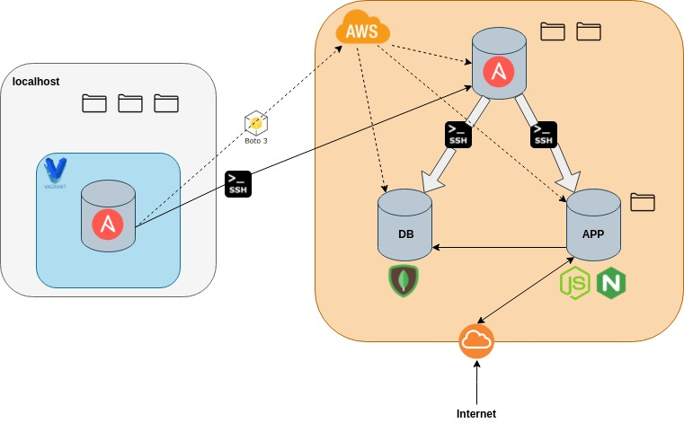

# Ansible Task

## Task Summary
Use ansible playbooks to launch 3 machines on AWS: a controller, a web-app and a database.
Implement the 2 tier architecture as IAC with ansible
Node app has to work with public IP and db working with `/posts`

## Acceptance Criteria
- Two-tier architecture on AWS
- Application fully working and communicating with database
- Configuration management with Ansible
- Resources brought up dynamically.
- Fully automatic; no manual steps needed.

## Solution
### Architecture
In this task, we are using a Vagrant VM as a controller, which spins up three EC2 instances on AWS.
From the three, one EC2 instance acts as a controller, while the other two are agents.



As can be seen in the diagram, 

### Summary
The above task is completed in a fully automated fashion. The only command required to be executed, is `vagrant up`.


### Security
To securely bring up the AWS servers, we use two sets of credentials.
Firstly, the IAM role credentials are used to bring up the resources, then an `ssh` key file that is used to secure the connections between the machines.

The security of the task is ensured with two main concepts:
1. The use and propagation of the `ssh-agent` to hold the connection keys.
2. Ask decryption passwords 'on the fly'.

The second concept, is to ask for decryption passwords on the fly, and never store anything important in files.
Below, an in-depth expalnation can be found, on how the concepts are enforced.

#### 1. Keys
To secure the `ssh` connections between machines, the key is encrypted in a `pem` file (`eng84devops.pem`)
located somehwere in the localhost. This key is loaded to the [`ssh-agent`](https://www.ssh.com/academy/ssh/agent), a helper program that keeps track of user identities and keys.

When the `ssh-agent` runs, it helps establish an `ssh` connection without having to specify the path to the `.pem` file with the identity flag `-i`.
However, the real advantage to using the `ssh-agent` is the fact that it can be forwarded between machines, helping us 'jump' connections with ease.

For example, in the case of this task, we have a virtual machine that needs to connect to the EC2 instances on the cloud.
On the local virtual machine, the `.pem` file is nowhere to be found, as it is not a good practice to transfer it.
Therefore, just by forwarding the `ssh-agent`, we can connect from the virtual machine to the cloud. Moreover, the agent can be forwarded once again, thereby allowing us to `ssh` into the agent nodes from the EC2 controller.


#### 2. Passwords
The credentials of the IAM role are needed by Ansible in order to provision the servers on AWS.
To secure those credentials, an encrypted file was created with with `ansible-vault`was created that contains all the information.
The encrypted information is kept in a secure location, and passed into the vagrant virtual machine. A sample encrypted file can be shown below:
```
$ANSIBLE_VAULT;1.1;AES256
346531373373233366330333423562333164623635465386161
643639346353766386537396186231326234333163434646262
303866623396434306235333363939643738383432533636135
643639346353766386537396186231326234333163434646262
373035396303134656134653616333313233393032261323263
643639346353766386537396186231326234333163434646262
636534386373366386636616213034643131346632531303965
```
The above file needs a password in order for ansible to decrypt it, and it would be better if the password was given by user input.
Therefore, a ruby module is used to request user input, and later pass it as arguments to a shell that calls the ansible playbook.
This way, the password is not stored anywhere:


In this way, we ensure the credentials are kept safe and secure.

### Networking
The netwoprking is done *ad-hoc*.
Firstly, a local virtual machine is brought up with vagrant. This machine runs ansible to provision three virtual machines in a VPC. In this implementation, they are all in the same subnet, although this can easily be changed.
When the cloud resources spin up, they are assinged a private IP in the VPC, and a public IP that is saved by the localhost. The localhost will then have `ssh` access to the controller via its public IP.

The controller will then be able to connect to the other instances with their internal IP. This makes the connection faster, and safer

### Provision

### Configuration
For configuring the cloud VMs, Ansible is used again. However, this time, Ansible is installed on one of the servers.
As shown on the architecture diagram, one of the servers will be 

### Notes
#### SSH connections with Ansible
#### Groupsnames and Hostnames
#### Environment variables 


