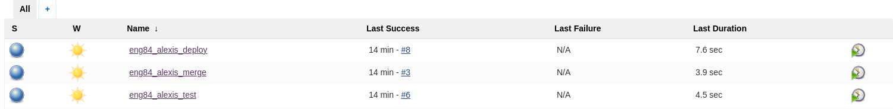

# Deployment Lab
> Time: 30 - 60 Minutes

## Summary
We've followed manual steps to get our code on to the production environment. But we should really automate this process.

Create a new jenkins job called Your Name Deploy. Set it up so that it performs the steps you just ran through.
Set this job to run when the CI testing job has finished successfully.
Make a change to the homepage of the app and push your code to the develop branch to test out your pipeline.

## Tasks
You should have three Jenkins jobs:
- Job to automatically build and test app on new commit to dev branch
- Job to merge dev to main branches
- Job to deploy on AWS EC2 once the code is merged to main

## Notes & tip
This job should pull from the `main` branch only.

There are many tools and methods for uploading files to a remote server. We want to keep it simple and use rsync and ssh as we've learned previously. Do not use the Publish over SSH plugins.

You can create this configuration entirely in your job using:
```
ssh
rsync
ssh-agent
credentials system
```

When jenkins attempts to connect via SSH it will ask for confirmation as we saw in the lesson. 
We can ask it to skip this confirmation with the following flags:
```
ssh -o "StrictHostKeyChecking=no" ubuntu@ ...
rsync -avz -e "ssh -o StrictHostKeyChecking=no" ...
```
You can send multiple commands over ssh with the following syntax

```
ssh -o "StrictHostKeyChecking=no" ubuntu@52.50.22.47 <<EOF
    # commands here...

EOF

```

## Acceptance Criteria
- Is it's own job on Jenkins
- Trigger is set to successful merge and publish of code
- Automatically transfer files into live server on EC2

## Solution
To create this pipeline, 3 Jenkins 'Freestyle Projects' were created:



The first job, `eng84_alexis_test`,  is called vai a webhook from github, which is triggered when a push has occured on the `dev` branch of the project. 
Next, the `dev` branch is cloned from github into a build environment and it is validated against the tests.
If this job succeeds, it calls the job `eng84_alexis_merge`to start executing.

In the merge job, the github `dev` branch is merged with the `main` branch.
To achieve this, an `ssh` key had to be deployed to the github project, so that Jenkins has the credentials for administrative access.
This allows Jenkins to merge the files.

Finally, if the second job succeeds, the third job is triggered, where an `ssh` connection is established with the EC2 instance where the application is hosted.
When the connection is established, the nesessary commands are executed to copy the newly edited files, then restart the `nodejs` application.


