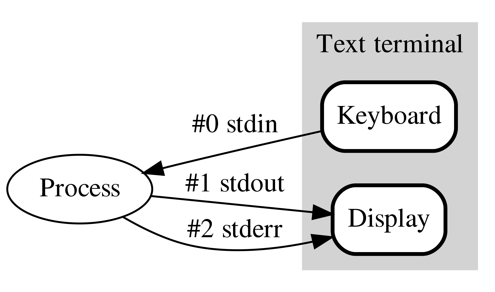
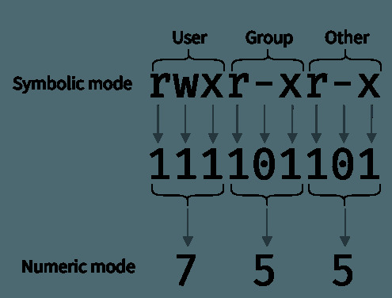

# Linux Commands

> This is not a comprehensive guide!

## Contents
1. [Shell Command Structure](#shell-command-structure)
2. [Linux Streams](#linux-streams)
3. [Pipelines and Redirects](#pipes-and-redirects)
4. [Navigation](#navigation)
5. [Listing and Searching](#listing-and-searching)
6. [File Viewing and Manipulation](#file-viewing-and-manipulation)
7. [Information](#information)
8. [Process Management](#process-management)
9. [File Permissions](#file-permissions)
10. [Environment Variables](#environment-variables)
11. [Networking](#networking)
12. [Secure Shell](#secure-shell)
13. [Secure Copy](#secure-copy)


## Shell Command Structure
Linux shell commands have a specific syntax.
```bash
[command] [options]
```
The first argument of the statements should be a command, followed by options. The options most often begin with a dash `-` and they may be grouped.
For example the options `-v` and `-f` can be combined into `-vf`, and will have the same function.

GNU systems also offer a more 'verbose' version of a flag, that usually starts with a double dash `--`. For example the flags `-v` and `--verbose` have the same function.
However, there are small differences to the verbose and shorthand versions of the flags. Firstly, the verbose commands cannot be combined with other options. They need to be specified separately.
Additionally, if an input is required for an option, with shorthand flags, the input should be inserted after the flag, separated with a space, but with the longer version, the input might be required after an `=` sign.

If unsure, the `man` command is a useful utility to check proper syntax and available options. To use the `man` command, use the linux shell syntax with `man` as the command, and the query command as option.
For example, if we want the manual for built-in command `ls`, we will type:
```bash
man ls
```
The `man` command uses the `less` utility program to display the information. This means we can search through it by pressing `/` followed by the querystring.
We can exit a `less` program with the `q` button.

## Linux Streams
When a linux command operates, three **streams** are established: `stdin`, `stdout` and `stderr`.

- The `stdin` stream is used as input to a program. It is usually taken from the keyboard input. 

- The `stdout` stream is the output of the program. When a program finishes executing, the `stdout` it outputs is displayed on the terminal.

- Finally `stderr` stream outputs errors from a program and is combined with the `stdout` to be displayed on the terminal. However, it can be redirected for logging purposes.

In Linux systems, every file that is currently opened, gets assigned an integer value, called **file descriptor**. These descriptors are a part of the POSIX API, a standard for maintaining compatibility between operating systems.
Streams in Linux are handled as files. Therefore, the streams have unique identifiers, **file descriptors** assigned to them.
The file descriptors associated with each stream can be seen below:
|value|stream|
|---|---|
|0 | `stdin`|
|1 | `stdout`|
|2 | `stderr`|

Additionally, `-1` values are reserved foo "no value" errors.


Data streams and their file desciptors can be visulised as shown below:



Linux processes do not care from where the streams are starting or terminating. That means, a process does not change behaviour if we the output stream heads towards a file or towards the terminal.
We can redirect the output of a linux process with pipes and redirects

## Pipes and Redirects

The behaviour mentioned earlier is one of the more powerful and useful features of shell scripting. 
Allowing the user to direct the outputs and inputs as needed increases the flexibility and the capability of unix processes.
The two commands that enable this behaviour is the pipe `|` and the redirect symbol `>`.

1. The pipe command

With the pipe symbol, we can 'pipe' the stdout of one process into the input of another. 
This means, we can have many dynamic processes, all feeding into each other, with minimal intervention by the user.
For example, we want to read a file and search for all the occurences of a pattern. We use the `cat` command to read, and we can search `stdin` with `grep`.
Therefore, by combining the two, we can search the file:
```sh
cat file.txt | grep -i 'pattern'
```
The above snippet will output all the lines where the pattern is found.
We can use the pipe command as many times as we want.
This means that, we can chain multiple commands. All of them getting input from the previous command, processing it somehow and later passing it to the next command.
In this way we can create useful and intricate pipelines that have complex behaviour, all in a single line, often called **one-liners**.

2. Redirect command.

The redirection command is used to redirect the `stdout` and `stderr` streams.
As mentioned earlier, the symbol `>` is used to specify a redirect command. After the `>` we specify the location, usually a file:
```sh
ls > list.txt
```
This is a shorthand that means "redirect the `stdout` to the file and the `stderr` to the terminal".
We can explicitly redirect both by prepending their file descriptors. That is, we can use `1>` to redirect `stdout` and `2>` to redirect `stderr`:

```sh
# Explicitly redirect stdout
ls ~/Documents 1> list.txt

# Explicitly redirect stderr
ls ~/NonExistentDirectory 2> log.txt

# Execute script, redirecting both stderr and stdout
./script.sh 1> output.txt 2> errors.txt
```
We can also redirect both streams to the same file with `2>&1` after we specify the file:
```sh
# Redirect stdout and stderr to log.txt
./script.sh > log.txt 2>&1
```
If we use a single `>` symbol, the file we place output will be truncated. If we want to append the output, we must use double `>>`:
```sh
# Overwrite log file with script output
./script.sh > log.txt

# Append script output to log file
./script.sh >> log.txt
```

Finally, we can perform the pipeline example shown above, by redirecting the output from a file to the `grep` command:

```sh
grep -i 'pattern' < file.txt
```


## Navigation

The primary way of navigating on Linux systems is with the `cd` command; We can either specify relative path or absolute.
The absolute path always starts from the root dir `/`. We can specify relative path by naming the directory directly (no `/` required).
If we need more information about where we are, or what directories are in our location, we can use the `pwd` to find our current path, and `ls` to get all the non-hidden directories and files.

> We can't use `sudo` to change directories. The reason is, `cd` is a builtin command, and `sudo` will look in the path but will not find it there.

We can also use several shortcuts that are listed below:

```bash
# Change directory to the user's home directory
cd ~
cd $HOME
cd

# Change one directory up
cd ..

# Change to previous working directory
cd -

# Print working directory
pwd

# Show directories (not hidden dirs)
ls -d */

```

## Listing and Searching
Many operating systems have aliases for common `ls` commands.
For example, on ubuntu, `ls` is aliased to include colours, or `ll` is an alias of `ls -alF`

We can use the `find` command to list files and directories. 
Find is normally used to find files with the `-name` command, where we can also use the asterisk (`*`) as a wildcard character.

The wildcard means it can be replaced with any other character, and can be used with almost any linux command.

```bash
# List files and directories in current directory
ls
ls --color=auto

# List files and directories, including hidden files (`-a`) on home directory
ls -a ~
ls -a $HOME

# List files, directories, including hidden files (`-a`) in a long listing format, with more information (`-l`). 
# Also classify with `*` for executables, `/` for dirs, `@` for symbolic links, `=` for sockets, `%` for whiteouts and `|` for FIFO
ll
ls -alF

# Find all directories and subdirectories in the current path
find . -type d

# Find all dirs in current path. Restrict to single level depth. Present in long-listing format (`-ls`)
find . -maxdepth 1 -type d -ls

# Count all files and subdirs in your home dir with depth 1
find ~ -maxdepth 1 | wc -l

# Find all textfiles in current directory
find . -maxdepth 1 -name *.txt

```

## File Viewing and Manipulation
A common practice to view the contents of a file is to use `cat`. Normally, `cat` is used to concatenate 
```
# Display file contents

cat


head


# View the last 10 lines of a file
tail filename.txt
tail -n 10 filename.txt
tail --lines 10 filename.txt

# Show last 10 lines of the file, track changes and print them in stdout
tail -F filename.txt

# Sort the lines of the file alphabetically
sort
```
We can even use minimal text editing programs like `nano` and `vim`. Both of them are pre-installed on most Linux distributions so it is useful to know how to use them.
When we enter `nano`, we can view the file contents, edit them, save the file and exit again. The commands are listed on the bottom of the screen. To exit the program without saving changes, press `ctl`+`x` simultaneously.
For `vim` it is more difficult to perform these actions due to its 'modal operation'. By entering different modes, the same keypresses have different functionality. To quickly exit the program, press `esc`, then type `:q!` and press `Enter` to not make any changes.

## Information
If we want to find out more info about a specific command, we can use `man` to bring up its manual.

```sh
man <command>
``` 

All core unix commands have a comprehensive manual including a description, syntax and parameter explanation for your convenience. 
The manual is brought up with the `more` program, which we can search with using the `/` key.

## Process Management
```
# Report a snapshot of current processes
ps

# 
# Display linux processes in a dynamic real-time view sorted in terms of CPU usage and display additional info like memory, threads and PID.
top
ps -aux
kill PID
killall process
```
## File Permissions
It is an important security feature in linux, that not all users can have access permission to certain files. 
Each file or directory has permissions based on user groups, called **Permission Groups**. The groups are split into `owner`, `group`, and `all users`.
These permissions are applying to the person that owns the file, the group that the file has been assigned, and all other users accordingly.

Each of these groups has a different *Permission Type*: `read`, `write` and `execute`.

flags `777`, `400`, `600`, `r`, `w`, `x`



```
chmod
```

## Environment Variables 
```
env
```
## Networking

## Secure Shell
The `ssh` is a protocol that allows secure connections to a remote host. The connections are encrypted, so before we establishing a connection, a key pair has to be created, and the public key exchanged
Additional settings can be added to the `ssh` command with the `-o` flag.
Some useful settings are `ForwardAgent`, `StrictHostKeyChecking`, etc.

The keys should be stored in `~/.ssh` directory, as ssh will search there first. If the key is located somewhere else, we need to specify it with the `-i` flag.
```
ssh
```

We can add a `config` file inside the `~/.ssh` dir. Example
```
Host <hostname>
  Hostname <IP>
  User <username>
  ...
```
Additionally, we can add commands to be executed to the remote host with the following syntax:
```bash
ssh <user>@<host-address> << 'EOF'
  # commands here
EOF
```
With the configuration file, we can add settings to the `ssh` connection without specifying them with the `-o` flag

### The ssh-agent
Typing passphrases for to decrypt `ssh` keys can be tedious, and so programs like the `ssh-agent` can help with that.
The `ssh-agent` stores the unencrypetd version of the key in program memory (process in Linux) so that it can be used whenever required.
This process does not terminate after the login session ends, unlike a normal `ssh` process, and can therefore persist throughout multiple logins. 
It can even be forwarded within the `ssh` session between hosts, allowing the key to be used on the remote host as well.
This is useful in the case of a jump host, where the key is required but we don't want to store it on the remote location.

Most Linux distributions have the `ssh-agent` running by default on startup.
To check if it is currently working, the environment variables `$SSH_AGENT_PID` and `$SSH_AUTH_SOCK` can be evaluated.
```bash
echo $SSH_AGENT_PID
```
If a PID is available, it means that the agent is not currently working. To start it, use:
```bash
eval "$(ssh-agent -s)"
```
Then, different keys can be added to the agent with the `ssh-add` command:
```bash
ssh-add ~/.ssh/<path-to-private-key>
```
If the key is encrypted with a passphrase, the agent will ask for it then store the key to check the current keys on the agent, use `ssh-add`:
```bash
ssh-add -L
```
### Jump Hosting
```sh
ssh -J
```
## Secure Copy
```
scp -i <identity.pem> <source> <user>@<ip>:<destination>
```


