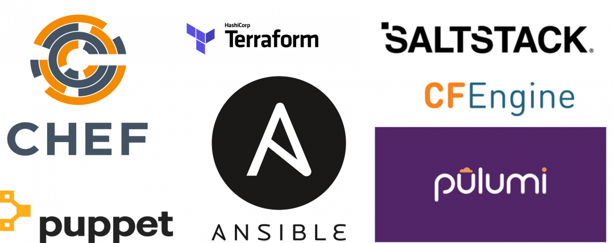

# Infrastructure as Code

Infrastructure as code is the process of managing and provisioning cloud resources through machine-readable definition files, rather than physical hardware configuration or interactive configuration tools.

## Types of Infrastructure
- Mutable or Immutable
- On premise or cloud

## Benefits
- Speed and simplicity
- Consistency
- Minimization of risk
- Increased efficiency in software development
- Cost savings

## Two parts of IaC

### Configuration Management
Tools that are responsible for provisioning and maintaining the state of your systems. Some common configuration management tools are:
- Chef
- Puppet
- Ansible

### Orchestration
Once we've created the templates for all the parts of the system, we can use orchestration tools and scripts that toalk to the cloud to pull them together into the architecture.
Common orchestration tools:
- cloudformation
- ansible
- terraform

## Ansible
### Simple
It uses `yaml`,
### Agentless
That is, when you create a controller, it contains the Ansible controller, but it does not require any configuration tool installation on the nodes it controls.
### Secure
It uses `ssh` to connect to other servers.
### Efficient SDLC
Integrates with other tools, 
We can change provider very easily.
