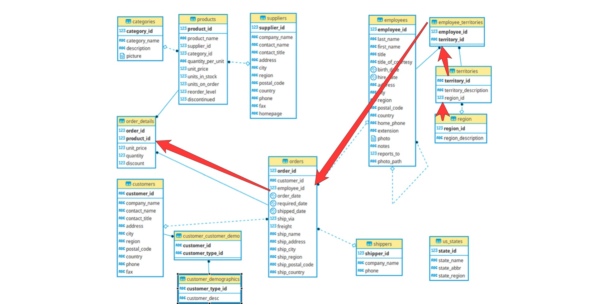
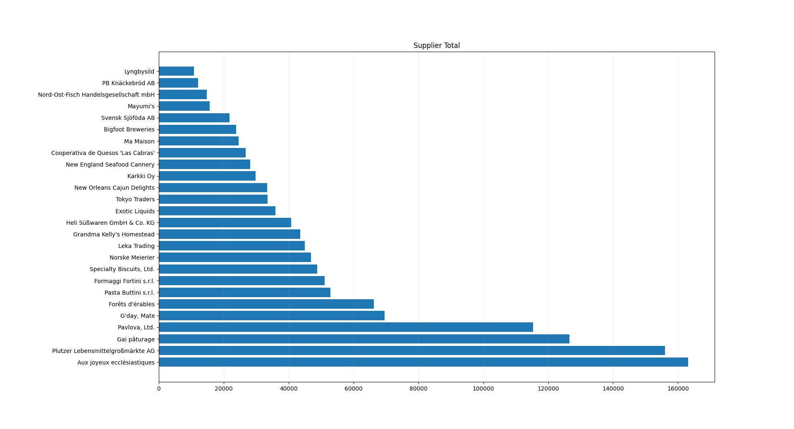
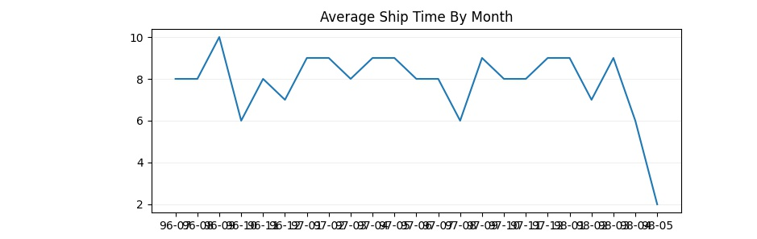

# Mini Project

## Part 1

> 1.1 Write a query that lists all Customers in either Paris or London. Include Customer ID, Company Name and all address fields. 

*Strategy: List all customers and filter them with a subquery based on their city*

```SQL
SELECT Customers.CustomerID, Customers.CompanyName, CONCAT(Customers.Address, ' ', Customers.PostalCode, ', ', Customers.Region, ', ', Customers.City)
    FROM Customers WHERE Customers.City IN ('London', 'Paris');
```

<br>
<br>

> 1.2 List all products stored in bottles.

*Strategy: Use a regular expression to find the products that contain the pattern 'bottle' in their quantity*

```SQL
SELECT * FROM Products WHERE Products.QuantityPerUnit LIKE '%bottle%';
```
<br>
<br>

> 1.3 Repeat question above, but add in the Supplier Name and Country.

*Strategy: Supplier Name and Country are not included in the Products Table, therefore an inner join is needed with the Suppliers Table.*

```SQL
SELECT pr.SupplierID, sp.CompanyName, sp.Country, pr.ProductID, pr.ProductName, pr.QuantityPerUnit
    FROM Products as pr
    INNER JOIN Suppliers as sp ON pr.SupplierID = sp.SupplierID
    WHERE pr.QuantityPerUnit LIKE '%bottle%';
```

<br>
<br>

> 1.4 Write an SQL Statement that shows how many products there are in each category. Include Category Name in result set and list the highest number first. 

*Strategy: Get Category name from Categories Table - join with Products. Then join the products based on their category id*

```SQL
SELECT prod.CategoryID, cat.CategoryName, COUNT(*) AS "Item Number" 
    FROM Products as prod 
    INNER JOIN Categories AS cat on prod.CategoryID = cat.CategoryID
    GROUP BY prod.CategoryID, cat.CategoryName
    ORDER BY COUNT(*) DESC;
```
<br>
<br>

> 1.5 List all UK employees using concatenation to join their title of courtesy, first name and last name together. Also include their city of residence. 

*Strategy: Simple WHERE filtering for Employee Country. Concatenation of Employee name, last name and title between spaces.*

```SQL
SELECT CONCAT(Employees.TitleOfCourtesy, ' ', Employees.FirstName, ' ', Employees.LastName) AS "Employee Name", Employees.City
    FROM Employees
    WHERE Employees.Country = 'UK';
```
<br>
<br>

> 1.6 List Sales Totals for all Sales Regions (via the Territories table using 4 joins) with a Sales Total greater than 1,000,000. Use rounding or FORMAT to present the numbers.  

*Strategy: In this exercise, the NORTHWIND database diagram was used to find the appropriate connection between tables, such that the 4 joints condition is met. 
For the Territories Table to also be included, the connection follows, as seen in the diagram below, starting from the Regions, then Territories, Employee Territories, then Orders and finally [Order Details].
The Employee Table was skipped, as the Employee IDs are included in the Order Table as well. The value of each Region was calculated by taking in account the discount applied as well.*


```SQL
SELECT rg.RegionID, rg.RegionDescription, FORMAT(ROUND(SUM(odt.Quantity * odt.UnitPrice * (1-odt.Discount)),-5), '###,###,###') as "Total Sales (Approx.)"
    FROM Region as rg
    INNER JOIN Territories as tr on rg.RegionID = tr.RegionID
    INNER JOIN EmployeeTerritories as emt on tr.TerritoryID = emt.TerritoryID
    INNER JOIN Orders as ord on emt.EmployeeID = ord.EmployeeID
    INNER JOIN [Order Details] as odt on ord.OrderID = odt.OrderID
    GROUP BY rg.RegionID, rg.RegionDescription
    HAVING SUM(odt.Quantity * odt.UnitPrice * (1-odt.Discount)) > 1000000;
```
<br>
<br>

> 1.7 Count how many Orders have a Freight amount greater than 100.00 and either USA or UK as Ship Country. 

*Strategy: Simple Filtering with two conditions; an inequality condition and a subquery looking for the keywords 'UK' and 'USA' in the Order Countries*

```SQL
SELECT COUNT(*) AS "Orders with Freight above 100 and destination US or UK" 
    FROM Orders
    WHERE Orders.Freight > 100 AND Orders.ShipCountry IN ('UK', 'USA');
```
<br>
<br>


> 1.8 Write an SQL Statement to identify the Order Number of the Order with the highest amount(value) of discount applied to that order.

*Strategy: Initially, the value of the products was taken from the Products Table, however that wasn't helpful as the value of the same products would be different in the [Order Details] Table.
Therefore, only the [Order Details] info is used. The orders are grouped by ID and then sorted with descending order based on the discount that is applied, which is calculated in the select statement. The first 
result is the order with the highest discount applied* 

```SQL
SELECT TOP 1 odt.OrderID, ROUND(SUM(odt.UnitPrice*odt.Quantity*odt.Discount),0) AS "Discount Applied" 
    FROM [Order Details] odt 
    GROUP BY odt.OrderID
    ORDER BY "Discount Applied" DESC
```

<br>
<br>
<br>

## Part 2

> 2.1 Write the correct SQL statement to create the following table: 
> 
> Spartans Table – include details about all the Spartans on this course. Separate Title, First Name and Last Name into separate columns, 
> and include University attended, course taken and mark achieved. Add any other columns you feel would be appropriate.  

*Strategy: Simple creation of table. Added extra column for date enrolled.*

```SQL
create table spartans_table (
    sparta_id INT IDENTITY(1,1) PRIMARY KEY,
    title VARCHAR(4),
    first_name VARCHAR(10),
    last_name VARCHAR(10),
    university VARCHAR(15),
    date_enrolled DATE,
    course_code CHAR(6),
    mark INT
)
```
<br>
<br>

> 2.2 Write SQL statements to add the details of the Spartans in your course to the table you have created.	 

```SQL
INSERT INTO spartans_table 
    VALUES
    ('Mr.', 'John', 'Smith', 'UCL', '10/1/2016', 'ECE456', 60),
    ('Ms.', 'Mary', 'Johnson', 'CAL', '10/2/2015', 'PHY213', 73),
    ('Dr.', 'Peter', 'Lowe', 'UoE', '09/28/2018', 'CS-112', 77 )
```
<br>
<br>
<br>

## Part 3

3.1 List all Employees from the Employees table and who they report to. No Excel required. Please mention the Employee Names and the Report To names. (5 Marks)

*Strategy:*

```SQL
SELECT CONCAT(emp.TitleOfCourtesy, ' ', emp.FirstName, ' ', emp.LastName) AS "Employee", CONCAT(man.TitleOfCourtesy, ' ', man.FirstName, ' ', man.LastName) AS "Manager"
    FROM Employees as emp
    LEFT JOIN Employees as man ON emp.ReportsTo = man.EmployeeID 
```

<br>
<br>

> 3.2 List all Suppliers with total sales over $10,000 in the Order Details table. Include the Company Name from the Suppliers Table and present as a bar chart as below: (5 Marks) 

*Strategy:*

```SQL
SELECT prd.SupplierID, Suppliers.CompanyName, FORMAT(SUM(odt.Quantity*odt.UnitPrice*(1-odt.Discount)), '###,###,###') AS "Sales"
    FROM [Order Details] as odt
    INNER JOIN Products as prd ON odt.ProductID = prd.ProductID
    INNER JOIN Suppliers ON prd.SupplierID = Suppliers.SupplierID
    GROUP BY prd.SupplierID, Suppliers.CompanyName
    HAVING SUM(odt.Quantity*odt.UnitPrice*(1-odt.Discount)) > 10000
    ORDER BY SUM(odt.Quantity*odt.UnitPrice*(1-odt.Discount))
```


<br>
<br>

> 3.3 List the Top 10 Customers YTD for the latest year in the Orders file. Based on total value of orders shipped. No Excel required. (10 Marks) 

*Strategy:*

```SQL
SELECT TOP 10 Customers.CustomerID, Customers.ContactName, SUM(odt.UnitPrice*odt.Quantity*(1-odt.Discount)) AS "Value of Orders"
    FROM Orders
    INNER JOIN Customers On Orders.CustomerID = Customers.CustomerID
    INNER JOIN [Order Details] as odt ON Orders.OrderID = odt.OrderID
    WHERE YEAR(Orders.OrderDate)=(SELECT MAX(YEAR(Orders.OrderDate)) FROM Orders)
    --WHERE Orders.OrderDate >= '19980101' AND Orders.ShippedDate IS NOT NULL
    GROUP BY Customers.CustomerID, Customers.ContactName
    ORDER BY SUM(odt.UnitPrice*odt.Quantity*(1-odt.Discount)) DESC
```

<br>
<br>

> 3.4 Plot the Average Ship Time by month for all data in the Orders Table using a line chart as below. (10 Marks)

*Strategy:*

```SQL
SELECT FORMAT(Orders.OrderDate, 'yy-MM') AS "Shipment month", AVG(DATEDIFF(d, Orders.OrderDate, Orders.ShippedDate)) AS "Days to Ship"
    FROM Orders
    GROUP BY FORMAT(Orders.OrderDate, 'yy-MM')
    ORDER BY FORMAT(Orders.OrderDate, 'yy-MM') 
```


