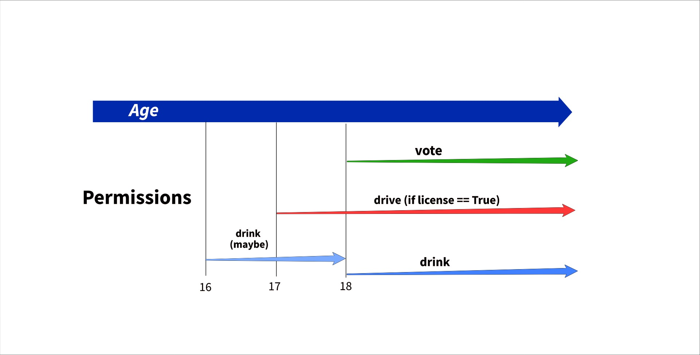

# TASK 9 - Control Flow Age and Permission
Control Flow Age and Permission
Timings
30 Minutes

## Summary
Simple program to use control flow!

## Tasks
Rules of what the program is supposed are shown below:
```
# Inputs
age = 19
driver_lisence = True

# Outputs
- You can vote and drive
- You can vote
- You can drive
- You can't legally drink but your mates/uncles might have your back (bigger 16)
- Your too young, go back to school!
```

## User Stories
As a user I should be able to keep being prompted for input until I say 'exit'

## Acceptance Criteria
* Is a program that run continuously
* Handles strings and integers
* Has exit condition
* All business logic works

## Documentation
The program is run with `python main.py`. Inside the main file, a number of functions are included. The  main funciton will start with a `while` loop
where user input is required. The user can enter any key to continue, or type and submit 'exit'/'EXIT' to leave.
If the user chooses to proceed, the user's age is requested. After the value of the age is analyzed, the user may be asked for a confirmation that they acquired a driver's license.
Finally, the program will output the user's permissions, according to the inputs that were submitted.

The function `get_permission()` can be imported and used on its own. It tales two arguments, an integer for age and a boolean that represents if the user has a driver's license.

Additionally, the function `showcase()` can be used to show the different scenarios on the terminal.


## Solution
The control flow of has been set up to to decide based on the age due to the fact that the other checks are correlated to the age of the subject. 
That is, the drivers license doesn't matter if a person is underage as it can only be acquired after 17. 
In the below chart, the control flow logic is summarized



Alternatively, the control flow can also be summarized with the below table:
|age < 16| 16 <= age < 17| 17 <= age < 18| age > 18|
| ---     | ---           | ---           | ---   |
| no drinking | maybe drinking| maybe drinking| drinking |
| no voting | no voting | no voting | voting|
| no driving | no driving | driving (if license)| driving (if license)|

The above table was coded in the function `get_permission` shown below.
Since the function can handle age as a string, a small snippet at the top of the function is used to transform it into an int (if applicable), else the function terminates.

Then, a chain of `if`-`elif` statements are used to check the above situations in sequence. Firstly the age is checked, and if needed the driver's license is checked as well.
For each situation, the appropriate message is printed:

```python
def get_permission(age, driver_license):
    # Check if age is number
    if isinstance(age, str):
        if age.isdigit():
            age = int(age)
        else:
            print('Bad value')
            return
    # age <= 16
    #   no drinking, no voting, no driving
    if age <= 16:
        print('You are too young, go back to school')

    # 16> age < 17
    #  maybe drinking, no voting,  no driving 
    elif age < 17:
        print('You might drink a little although illegal')
    # 17 >= age < 18
    #  maybe drinkin, no voting, driving 
    if license == True
    elif age < 18:
        # check license
        if driver_license:
            print('You can drive')
        else:
            print("You still can't drive")
    # age > 18
    #   drinking, voting, driving 
    if license == True
    else:
        if driver_license:
            print('You can vote and drive')
        else:
            print('You can drive')
```

Again, different functions are used to foolproof user info are shown below:
```python
# Function used to get a number from user input, ask again if not appropriate and return it as integer
def ask_number():
    while True:
        choice = input()
        if choice.isdigit():
            choice = int(choice)
            if num_in_bounds(choice):
                return choice
        print('Bad value. Try again: ')


# Check if the number is above 0
def num_in_bounds(number):
    if number > 0:
        return True
    return False


# Return True if value is 'y' or 'yes'. Return False if 'n' or 'no'. Return None otherwise
def yes_no_true_false(value):
    if value.lower() in ['y', 'yes']:
        return True
    elif value.lower() in ['n', 'no']:
        return False
    return None


# Continue asking for user input until yes or no is given
def ask_yes_no():
    while True:
        choice = yes_no_true_false(input())
        if choice is not None:
            return choice
        print('Bad value')
```

The above functions are required to make the `main` function work. In `main`, a while loop is used to run the program continuously, until the
user enters 'exit'. Inside the outer loop, the function that handles input for age is called.
The age is stored immediately used to check if the subject is old enough to drive. If so, a further if statement checks if the subject has a driver's license.
The question is answered with a 'yes' or 'no' answer. The UI for this check is implemented with the function `ask_yes_no`.
Aftrer all the required inputs are gathered, they are passed as arguments to the `get_permission` function shown earlier.
Below, the main UI function is shown:
```python
def main():
    # main loop
    while True:
        choice = input("\nCheck your permissions?\n (Enter any value to continue, or enter 'exit' to quit)\n")
        # check for exit condition
        if choice.lower() == 'exit':
            break
        print('What is your age?')
        age = ask_number()
        if age >= 17:
            print('Do you have a license(y/n)?')
            drivers_license = ask_yes_no()
            get_permission(age, drivers_license)
        else:
            # if driver is less than 17 don't even ask for license
            get_permission(age, False)
    # exit condition, user types 'exit'
    print('Goodbye')
```
