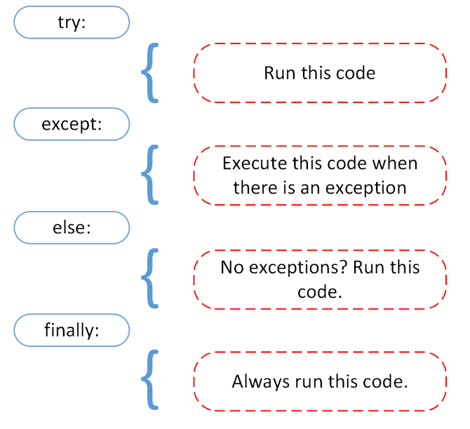

# Exception Handling in Python

When the python interpreter encounters an error, it terminates execution.
This error can either be a syntax error, or an exception.

## Exceptions versus Syntax Errors
**Syntax errors** are different to **exceptions**. The first occurs when a statement is incorrect, while the latter are errors that occur on syntactically correct statements. 
Usually, when exception errors occur, a message indicates what type of error has occured.

## Raising an exception
Python has differnt types of *built-in* exception errors, like **ModuleNotFoundError**, **AttributeError**, **TypeError**, **ValueError** and **ZeroDivisionError** among others.
We can even use the `raise` keyworkd to throw an exception if a condition occurs. In this way, we can create a *custom exception*.

Suppose we wanted to raise an exception if an input that was given is larger than 5. We can use an `Exception` to stop execution if that condition occurs:
```python
x = input()
if x.isdigit():
    if int(x) > 5:
        raise Exception('x should not be larger than 5, but the value given was {}'.format(x))
```
If we run the above command and give input 6, we will get the following output:
```python
Traceback (most recent call last):
  File "test.py", line 4, in <module>
Exception: x should not be larger than 5, but the value given was 6
```
The execution terminates, but we have a clue as to why it stopped, due to the message attached to the exception

## Assert Exceptions
Other than raising exceptions, in Python we can make use of the `assert` command that behaves opposite to the `raise` keyword.
With the `assert` command, we can test if a condition is met. If the condition turns out th be `True`, then the program continues to run normally.
Otherwise, if the assertion turns out to be `False`, an `AssertionError` exception is raised.

For example, we could have an `assert` condition on the beginning of a Python script that checks if the file runs Linux:
```python
import os
assert ('linux' in sys.platform), "This code runs on Linux only"
```
If the file is run on a Linux machine it passes, however, if it is run on a Windows machine, it will terminate the execution and throw an error:
```python
Traceback (most recent call last):
  File "<input>", line 2, in <module>
AssertionError: This code runs on Linux only.
```

## Handling Exceptions with the `try` and `except` block
Exceptions are a normal part of Python coding, however, if they are not handled they will crash the program.
In order to handle these exceptions, we use the keywords `try` `except`, `else` and `finally`.


The `try`-`except` blocks can be thought of as an `if`-`else` block. 
If the exception that occurs under the `try` keyword matches one of the exceptions specified at the `except` block, the code under `except` will run.
The `else` statement is used to execute commands if no exceptions were raised, and the `finally` is used for commands that should be executed wether an exception occured, or not.

Suppose we have a file called `orders.txt`, and try to read it within the `orders.py` file:
```txt
# orders.txt
pizza
salad
soda
```

```python
# orders.py
try:
    # file = open('orders01.txt')
    file = open('orders.txt')
    print('File found')
except IOError:
    print('The above block was not executed')
finally:
    print("Thank you")
```
The above code will execute correctly even if the `orders.txt` file does not exist.
We can try this by changing the filename to be opered to `orders01.txt` which was not created yet.
The except block will catch the error and print a message, instead of stopping execution.

## Note: IO with files using Python

| Mode |Description|
| :----: |:---- |
|'r' |This is the default mode. It Opens file for reading. |
|'w' |This Mode Opens file for writing. If file does not exist, it creates a new file. If file exists it truncates the file.|
|'x' |Creates a new file. If file already exists, the operation fails.|
|'a' |Open file in append mode. If file does not exist, it creates a new file.|
|'t' |This is the default mode. It opens in text mode.|
|'b' |This opens in binary mode.
|'+' |This will open a file for reading and writing (updating)|

## CRUD
Stands for `create`, `read`, `update`, `delete`.
